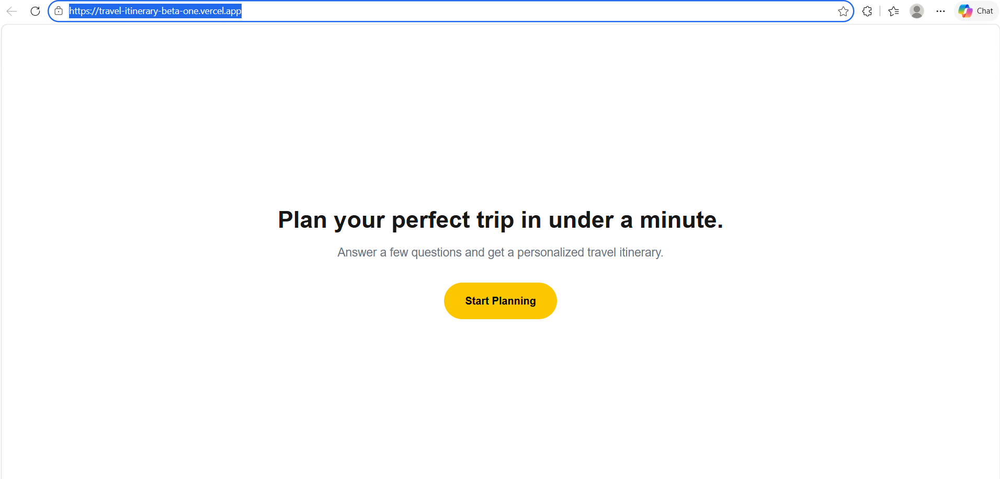
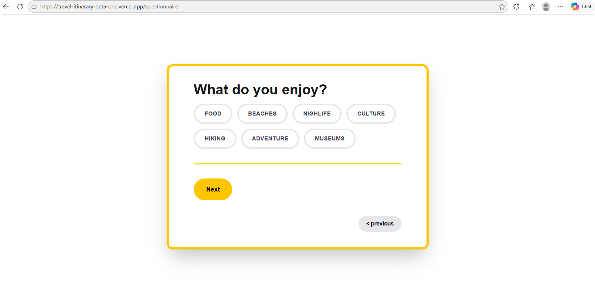
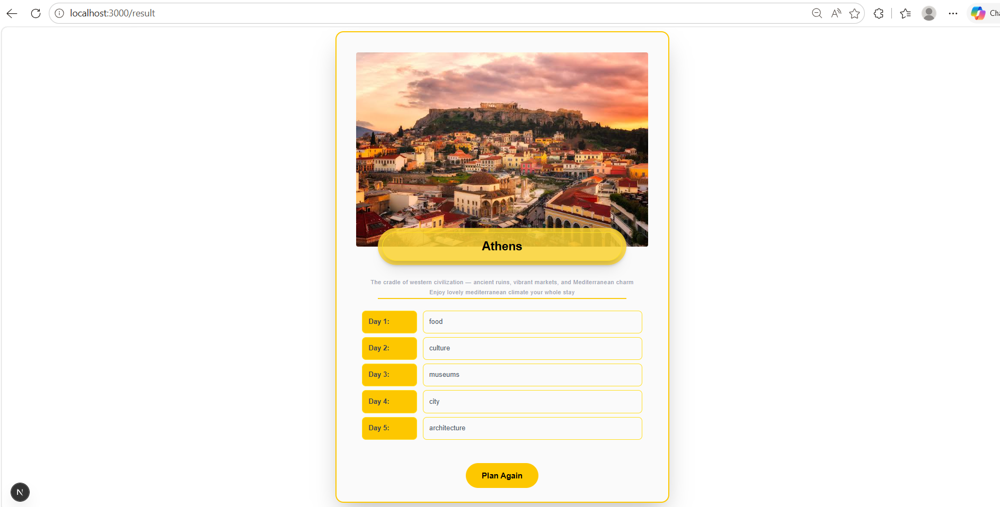

This is a full-stack web application built with [Next.js](https://nextjs.org). The application lets user enter information in questionnaire page, resulting in showing the ideal destination and basic itinerary.

## Live demo link

[https://travel-itinerary-beta-one.vercel.app/]

## Screenshots

-landing page - basic, simple style.

- Example of one question in the questionnaire (first UI look)

- Result page (The final recommendation generated by the scoring algorithm)



## Tech stack
- Next.js
    - full-stack framework handling both frontend and backend
- TypeScript 
- Tailwind CSS
- PostGreSQL
    - via Prisma/Supabase

 ## Architecture
The core of this app is built on a custom scoring algorithm that matches user preferences to destinations stored in the database.
In this version, it loads database and compares the relative object properties with user preferences taken from the questionnaire. The function scoreDestination() will simply return the destination with the highest score. Additionaly, based on the entered days, it will generate the first ever version of itinerary choosing a random tag thats mapped to destionation that was chosen with algorithm. Later, Itinerary will use AI to generate a better itineraries.

After user finishes the questionnaire, API route is called, directing to the scoring algorithm, which gives the result and displays it on final result page. 

Updates made in v2:
- Added 8 new destinations (14 total)
- Added lifestyle preferences (solo, pair, friends, family)
- Added travel type (relaxation, sightseeing, adventure)
- Added stay vs. explore preference
- Improved scoring weights - lifestyle tags (+5), travel type (+4), activities (+2)
- Added hard filters - incompatible climate and budget differences result in elimination

## How to run locally

```bash
git clone https://github.com/jancastachova/travel-itinerary.git
cd travel-itinerary
# install npm
npm install
# set .env (copy database_url)
# Run database migrations(creates tables based on Prisma schema)
npx prisma migrate dev
# connect seed
npx prisma db seed
# run the application
npm run dev
```

Open [http://localhost:3000] with your browser to see the result
